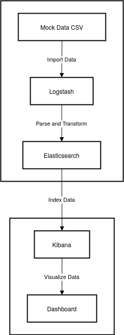
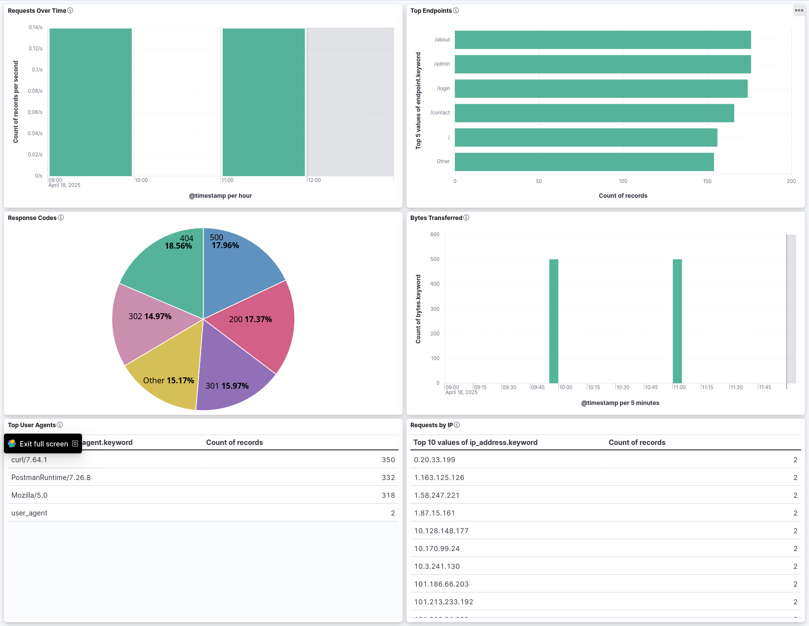
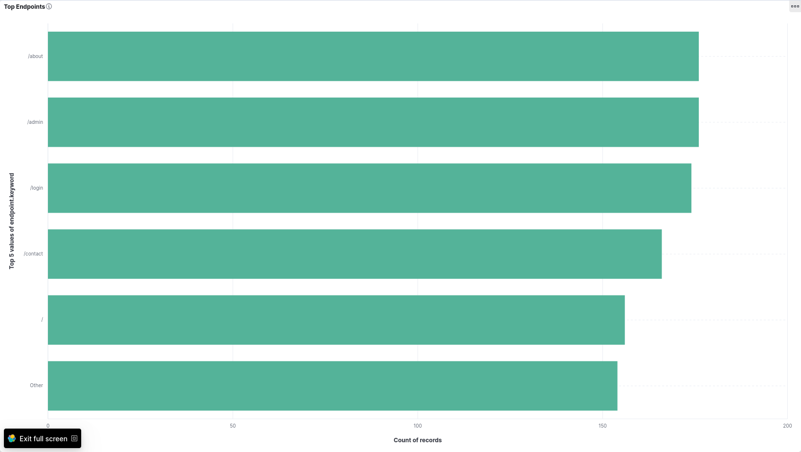
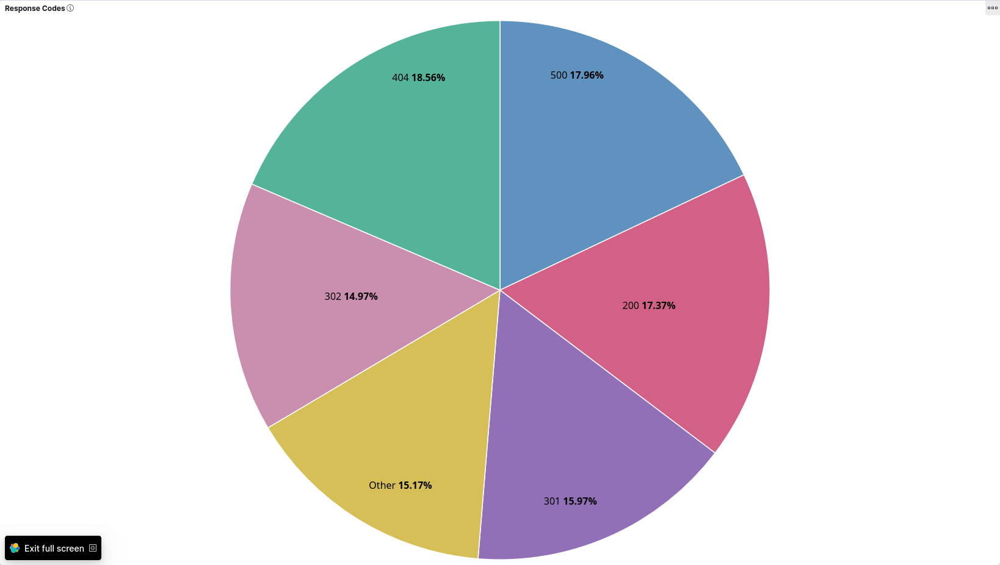
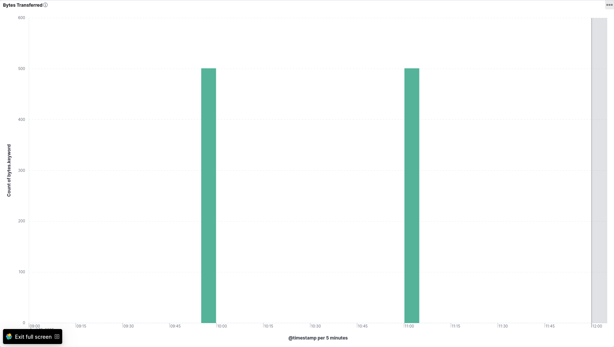
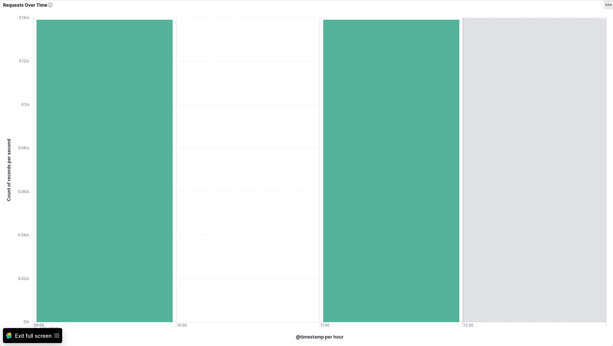
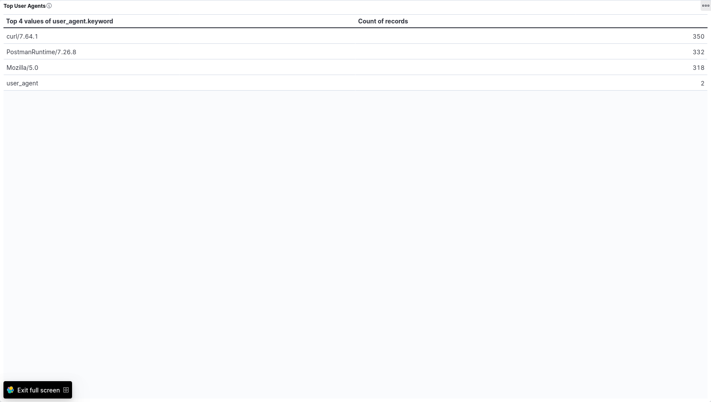
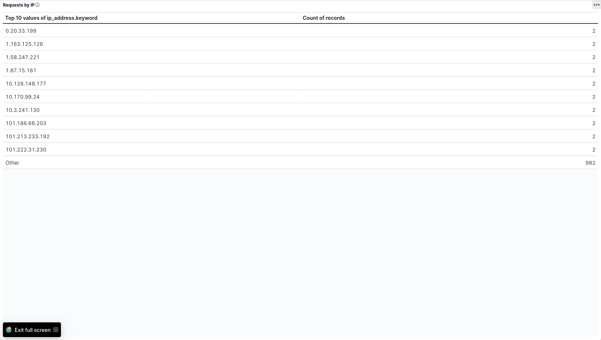

# KibanaCaseStudy

🏴 A simple ELK stack project to visualize access logs using Docker Compose.

## Features

- Ingests raw Nginx logs using Logstash
- Parses logs with GROK filters
- Visualizes data in Kibana dashboards
- Built with Elasticsearch 7.17 and Kibana 7.17

## Mockaroo Field Setup

| Field Name  | Type        | Custom Format / Format                                |
| ----------- | ----------- | ----------------------------------------------------- |
| ip_address  | IP Address  |                                                       |
| dash1       | Custom List | -                                                     |
| dash2       | Custom List | -                                                     |
| timestamp   | Datetime    |                                                       |
| method      | Custom List | GET, POST, PUT, DELETE                                |
| endpoint    | Custom List | /, /login, /products, /about, /contact, /admin        |
| protocol    | Custom List | HTTP/1.0, HTTP/1.1, HTTP/2                            |
| status_code | Custom List | 200, 301, 302, 404, 500, 403                          |
| bytes       | Number      | Min: 20, Max: 5000                                    |
| referrer    | Custom List | "-"                                                   |
| user_agent  | Custom List | "Mozilla/5.0", "curl/7.64.1", "PostmanRuntime/7.26.8" |

## How To Run It

```bash
docker-compose up
```

Then visit http://localhost:5601

# Architecture Diagram

<div align="center">



</div>

---

# 📊 Dashboard Preview

## 🔹 Important Metrics



### Individualized Visualizations

#### 📈 Requests Over Time


_Shows number of requests per minute._

---

#### 📊 Top Endpoints


_Most accessed API routes._

---

#### 🧾 Response Codes


_Distribution of status codes._

---

#### 🧭 Requests by Method


_HTTP methods used (GET, POST, etc.)_

---

#### 📦 Bytes Transferred


_Total traffic volume over time. GET, POST, etc._

---

#### 🕵️‍♂️ Top User Agents


_Most active clients accessing the server._

---

#### 🌐 Requests by IP


_Top visitor IP addresses._

---

## Importing The Dashboard

1. Go to "Management → Stack Management → Saved Objects"
2. Click “Import”
3. Upload the .ndjson file
4. Click “Import”

---
